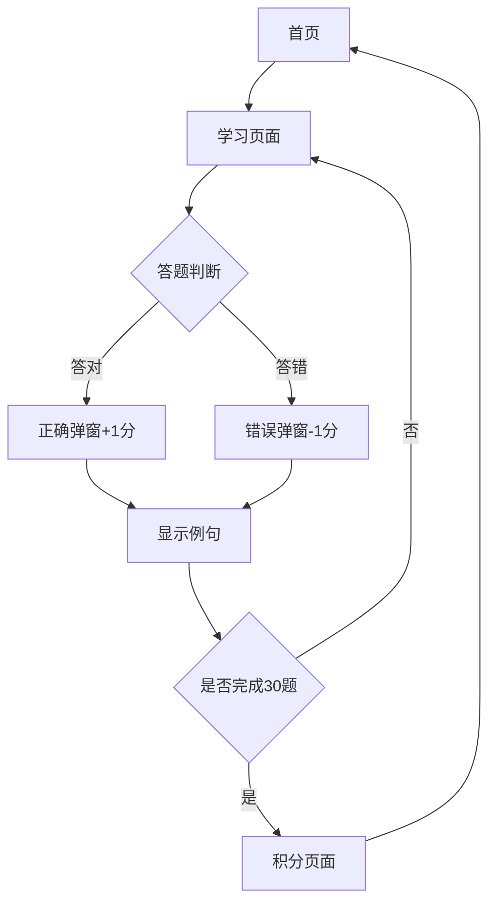

## 1. 产品概述
儿童英语学习网站，包含3000个英语单词的学习内容。采用游戏化学习方式，通过图片选择题帮助儿童记忆单词，配合发音功能和积分系统提高学习趣味性。

目标用户为3-12岁儿童及其家长，通过每日30题的学习任务培养英语学习习惯，可爱风格的界面设计吸引儿童注意力。

## 2. 核心功能

### 2.1 用户模式
本产品采用游客模式，无需注册登录即可使用所有功能。用户数据（每日积分、每周积分、题目进度）保存在浏览器本地存储中，关闭浏览器后数据仍然保留。

### 2.2 功能模块
网站主要包含以下页面：
1. **首页**：学习日历、今日任务入口、总积分显示、背景音乐控制（无需登录）。
2. **学习页面**：图片显示、四个选项、发音按钮、例句展示、答题弹窗、积分动画（进度自动保存）。
3. **积分页面**：每日积分详情、每周积分统计、学习成就展示（数据来自本地存储）。

### 2.3 页面详情
| 页面名称 | 模块名称 | 功能描述 |
|----------|----------|----------|
| 首页 | 学习日历 | 显示周一至周日的学习状态，已完成日期标记为彩色，数据保存在本地存储 |
| 首页 | 今日任务 | 显示今日30题的完成进度，点击进入学习页面，进度实时保存 |
| 首页 | 总积分显示 | 显示当前总积分和本周积分，包含动画效果，积分数据本地存储 |
| 首页 | 背景音乐 | 播放/暂停可爱的背景音乐，音量可调节，设置保存在本地 |
| 学习页面 | 图片显示区 | 预加载高清图片，显示当前单词对应的图片，3000词汇从静态数据或CDN加载 |
| 学习页面 | 发音功能 | 点击喇叭图标播放单词标准发音，可重复播放 |
| 学习页面 | 选项区域 | 显示4个单词选项，点击后判断对错 |
| 学习页面 | 例句展示 | 显示当前单词的英文例句和中文翻译 |
| 学习页面 | 答题反馈 | 答对显示绿色弹窗+1分，答错显示红色弹窗-1分，带音效 |
| 学习页面 | 进度指示 | 显示当前题目序号和总题数（如第5/30题），答题进度实时保存 |
| 积分页面 | 每日详情 | 显示每天的学习得分和完成时间，数据从本地存储读取 |
| 积分页面 | 每周统计 | 显示本周总得分和学习天数，基于本地数据统计 |
| 积分页面 | 成就系统 | 显示获得的徽章和学习里程碑，成就数据本地存储 |

## 3. 核心流程

### 学习流程
1. 进入首页查看今日学习任务（无需登录）
2. 点击"开始学习"进入学习页面
3. 查看图片并听取单词发音
4. 从四个选项中选择正确答案
5. 查看答题反馈和积分变化（数据实时保存到本地存储）
6. 阅读例句加深理解
7. 继续下一题直到完成30题
8. 查看今日得分和成就（数据保存在浏览器本地）

## 4. 用户界面设计

### 4.1 设计风格
- **主色调**：天蓝色(#87CEEB)和粉红色(#FFB6C1)搭配
- **辅助色**：柠檬黄(#FFFF99)、草绿色(#90EE90)
- **按钮样式**：圆润的3D立体按钮，带悬停动画效果
- **字体**：Comic Sans MS或类似卡通字体，主标题24px，正文18px
- **布局风格**：卡片式布局，圆角设计，大量使用可爱图标和emoji
- **图标风格**：手绘风格图标，使用动物、星星、彩虹等儿童喜爱元素

### 4.2 页面设计概述
| 页面名称 | 模块名称 | UI元素 |
|----------|----------|--------|
| 首页 | 学习日历 | 7个圆形日期按钮排成一排，完成的日期显示彩色图标，未完成显示灰色 |
| 首页 | 积分显示 | 大号数字显示总积分，旁边有跳动的星星动画 |
| 学习页面 | 图片区域 | 占据页面40%空间，圆角边框，预加载loading动画 |
| 学习页面 | 选项按钮 | 四个彩色按钮，2x2排列，点击时有缩放动画 |
| 学习页面 | 发音按钮 | 黄色小喇叭图标，点击时播放音效并有波纹动画 |
| 学习页面 | 弹窗反馈 | 半透明背景，中央显示大图标（对勾或叉号），带音效 |
| 积分页面 | 统计图表 | 彩色柱状图显示每日得分，使用彩虹色彩 |

### 4.3 响应式设计
- 采用桌面优先设计，主界面为1200px宽度
- 平板端自适应为768px，保持核心功能完整
- 移动端简化布局，主要功能垂直排列
- 触摸交互优化：按钮增大到最小44px，支持滑动操作

### 4.4 音效设计
- **背景音乐**：轻快可爱的儿童音乐，支持循环播放
- **正确音效**：清脆的"叮"声，音调较高
- **错误音效**：温和的"嘭"声，音调较低
- **按钮音效**：软萌的"啵"声，增强交互感
- **成就音效**：欢快的音乐片段，持续2-3秒