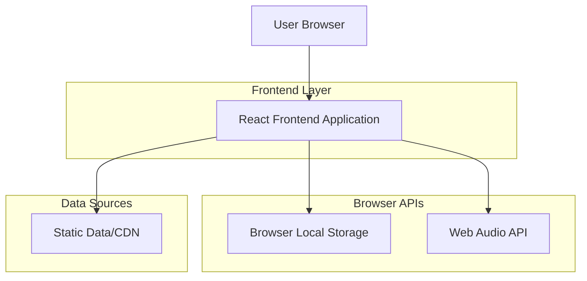

## 1. 架构设计



## 2. 技术描述

- **前端**: React@18 + tailwindcss@3 + vite
- **初始化工具**: vite-init
- **后端**: 无后端，纯前端应用
- **数据存储**: 浏览器Local Storage
- **音频处理**: Web Audio API + 预加载机制
- **图片处理**: 懒加载 + 预加载策略
- **词汇数据**: 静态JSON文件或CDN加载

## 3. 路由定义

| 路由 | 用途 |
|-------|---------|
| / | 首页，显示学习日历和总积分 |
| /learn/:day | 学习页面，显示每日30道题目 |
| /score | 积分页面，显示每日和每周统计 |

## 4. 本地存储设计

### 4.1 本地存储结构
```typescript
interface LocalStorageData {
  // 学习进度
  learningProgress: {
    [day: number]: {
      completedQuestions: number;
      score: number;
      completedAt: string;
      answers: Array<{
        wordId: string;
        isCorrect: boolean;
        timestamp: string;
      }>;
    };
  };
  
  // 总积分和设置
  totalScore: number;
  weeklyScore: number;
  soundEnabled: boolean;
  musicEnabled: boolean;
  musicVolume: number;
  
  // 当前学习状态
  currentDay: number;
  currentQuestion: number;
}
```

### 4.2 词汇数据格式
```typescript
interface WordData {
  id: string;
  word: string;
  imageUrl: string;
  audioUrl: string;
  exampleSentence: string;
  translation: string;
  options: string[]; // 4个选项，包含正确答案
  correctOption: number; // 正确答案索引
}

// 3000个词汇存储在静态JSON文件中
const VOCABULARY_DATA: WordData[] = [
  // ... 3000个单词数据
];
```

## 5. 前端状态管理

### 5.1 应用状态结构
```typescript
interface AppState {
  currentDay: number;
  currentQuestion: number;
  dailyProgress: DailyProgress;
  currentWord: WordData | null;
  totalScore: number;
  weeklyScore: number;
  isLoading: boolean;
  soundEnabled: boolean;
  musicEnabled: boolean;
  musicVolume: number;
}

interface DailyProgress {
  day: number;
  completedQuestions: number;
  totalQuestions: number;
  score: number;
  isCompleted: boolean;
  answers: Array<{
    wordId: string;
    isCorrect: boolean;
    timestamp: string;
  }>;
}
```

### 5.2 本地存储管理
```typescript
class LocalStorageManager {
  private static readonly STORAGE_KEY = 'kid_english_data';
  
  static getData(): LocalStorageData | null
  static saveData(data: LocalStorageData): void
  static clearData(): void
  static updateProgress(day: number, progress: DailyProgress): void
  static updateScore(totalScore: number, weeklyScore: number): void
  static updateSettings(settings: { soundEnabled: boolean; musicEnabled: boolean; musicVolume: number }): void
}
```

### 5.3 音频管理
```typescript
class AudioManager {
  private backgroundMusic: HTMLAudioElement;
  private soundEffects: Map<string, HTMLAudioElement>;
  private musicVolume: number;
  private soundEnabled: boolean;
  private musicEnabled: boolean;
  
  preloadSounds(): Promise<void>
  playCorrectSound(): void
  playWrongSound(): void
  playBackgroundMusic(): void
  stopBackgroundMusic(): void
  setSoundEnabled(enabled: boolean): void
  setMusicEnabled(enabled: boolean): void
  setMusicVolume(volume: number): void
  loadSettings(): void
  saveSettings(): void
}
```

### 5.4 图片预加载
```typescript
class ImagePreloader {
  private imageCache: Map<string, HTMLImageElement>;
  private cdnBaseUrl: string;
  
  preloadImages(wordIds: string[]): Promise<void>
  getImage(wordId: string): HTMLImageElement | null
  clearCache(): void
  loadFromCDN(imageUrl: string): Promise<HTMLImageElement>
}
```

### 5.5 词汇数据管理
```typescript
class VocabularyManager {
  private static vocabularyData: WordData[] | null = null;
  
  static async loadVocabularyData(): Promise<WordData[]>
  static getWordById(wordId: string): WordData | null
  static getWordsForDay(day: number, questionsPerDay: number): WordData[]
  static getTotalWordCount(): number
}
```